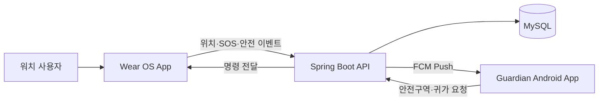

# Architecture

## 시스템 경계



## 책임 분리

### Wear OS App

- 센서 원시 데이터 수집과 규칙 기반 낙상 후보 판정
- 낙상 후 사용자 응답 및 무응답 타이머
- 수동·자동 SOS 생성
- GPS 획득과 배터리 절약형 위치 갱신
- 안전구역 이탈 경고 및 귀가 안내

### Guardian App

- 사용자의 최근 위치, 갱신 시각, 안전 상태 표시
- 안전구역 생성·수정·삭제
- 긴급 Push 처리 및 사건 상세 표시
- 귀가 요청 전송
- 시간순 안전 이벤트 기록 표시

### Backend

- 사용자·보호자·디바이스 연결 관계 관리
- 최신 위치와 중요 위치 이벤트 저장
- 안전구역 및 안전 이벤트 관리
- FCM 토큰과 Push 전달
- 요청 중복 방지 및 감사 가능한 이벤트 기록

## 초기 수직 기능

첫 통합 목표는 다음 한 줄입니다.

```text
워치 수동 SOS → GPS → Backend 저장 → FCM → 보호자 긴급 화면
```

이 흐름이 완성된 후 낙상 자동화, 안전구역, 귀가 안내를 추가합니다.

## 데이터 원칙

- 정상 상태 위치는 초단위로 저장하지 않습니다.
- SOS·안전구역 이탈·도착 시 위치를 즉시 저장합니다.
- 원시 센서 데이터는 운영 서버에 상시 전송하지 않습니다.
- 센서 학습 데이터는 운영 데이터와 분리하고 참여자 동의를 받습니다.
- 상세 위치 보관 기간은 개발 전에 팀이 명시적으로 결정합니다.
